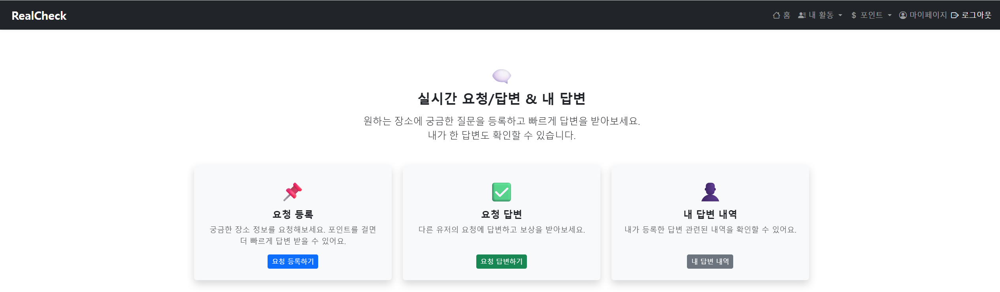
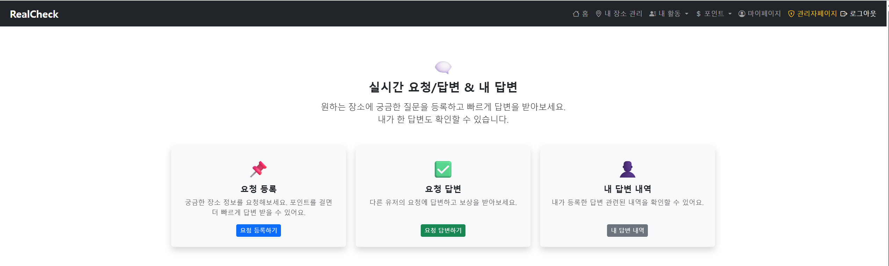

# 📍 RealCheck

> **실시간 현장 정보 공유 플랫폼**
> 사용자들이 주변의 대기 상태, 편의시설, 요청 응답 등을 실시간으로 주고받는 위치 기반 커뮤니티 서비스입니다.

---

<details>
<summary>🛠️ <strong>기술 스택</strong></summary>

| 구분           | 기술                                               |
| ------------ | ------------------------------------------------ |
| **Backend**  | Java 17, Spring Boot 3.4.4, Spring Security, JPA |
| **Frontend** | JSP, jQuery, JavaScript, Bootstrap 5, CSS        |
| **Database** | MySQL 8, Redis (세션/캐시)                           |
| **Infra**    | AWS EC2, RDS, Nginx, Certbot (HTTPS)             |
| **API**      | RESTful API, Naver Maps API                      |
| **Others**   | GitHub, Maven, Linux shell 배포                    |

</details>

---

<details>
<summary>💡 <strong>주요 기능 요약</strong></summary>

### 👤 사용자 기능

* 회원가입 / 로그인 (세션 기반)
* 마이페이지 (활동 로그, 포인트 이력, 장소 관리)
* 요청 등록 및 응답 작성, 채택
* 자발 공유(FREE\_SHARE) 및 조회수 기반 포인트 지급
* 장소 등록, 승인 대기/반려/수정
* 포인트 충전/사용/환전 요청
* 신고 기능 (자동 블라인드 처리)

### 🗺️ 지도 기능

* 현재 위치 기반 요청/공유글 지도 보기
* 반경 3km 내 공식 장소별 커뮤니티 페이지
* 장소별 응답 묶음 및 질문 더보기 기능

### 🛡️ 관리자 기능

* 사용자, 요청, 공유글, 신고, 장소 전체 관리
* 통계 조회: 월별 사용자/요청/응답/신고/포인트
* 관리자 활동 로그(AdminActionLog)
* FREE\_SHARE 블라인드 및 포인트 환급/재발급

</details>

---

<details>
<summary>📁 <strong>프로젝트 구조</strong></summary>

```
realcheck/
└── src/
    └── main/
        ├── java/com/realcheck/
        │   ├── admin/
        │   ├── common/
        │   ├── config/
        │   ├── deletionlog/
        │   ├── file/
        │   ├── naver/
        │   ├── page/
        │   ├── place/
        │   ├── point/
        │   ├── report/
        │   ├── request/
        │   ├── scheduler/
        │   ├── status/
        │   ├── user/
        │   └── util/
        ├── resources/
        │   ├── static/
        │   │   ├── css/
        │   │   └── js/
        │   └── templates/
        └── webapp/WEB_INF/views (jsp)
            ├── admin/
            ├── common/
            ├── map/
            ├── place/
            ├── point/
            ├── request/
            ├── stauts/
            └── user/
```

</details>

---

<details>
<summary>🚀 <strong>실행 방법</strong></summary>

```bash
# 1. 의존성 설치
./mvnw clean install

# 2. 빌드
./mvnw package

# 3. 실행 (EC2 등 서버 환경에서)
java -jar target/realcheck-0.0.1-SNAPSHOT.jar
```

</details>

---

<details>
<summary>🌐 <strong>배포 환경</strong></summary>

* HTTPS 지원: [https://real-check.store](https://real-check.store)
* Nginx reverse proxy + Certbot SSL
* EC2 + RDS(MySQL) + Redis 구성

</details>

---

<details>
<summary>📸 <strong>프로젝트 시연</strong></summary>

<details>
<summary>🧭 메인페이지</summary>
<h6>메인 화면</h6>


<h6>헤더 일반 사용자</h6>



<h6>헤더 관리자</h6>

 

</details>

<details>
<summary>👤 사용자 기능</summary>
<h6>회원 가입</h6>


> 예: `/static/images/demo_user_mypage.png`

</details>

<details>
<summary>📨 요청 기능</summary>

> 예: `/static/images/demo_request_create.png`
> 예: `/static/images/demo_request_list.png`

</details>

<details>
<summary>💬 답변 기능</summary>

> 예: `/static/images/demo_answer_write.png`
> 예: `/static/images/demo_answer_selected.png`

</details>

<details>
<summary>📍 장소 기능</summary>

> 예: `/static/images/demo_place_register.png`
> 예: `/static/images/demo_place_edit.png`

</details>

<details>
<summary>🛡️ 관리자 기능</summary>

> 예: `/static/images/demo_admin_dashboard.png`
> 예: `/static/images/demo_admin_users.png`

</details>

</details>

---

<details>
<summary>🙋‍♂️ <strong>개발자 정보</strong></summary>

| 이름  | 역할                       | GitHub                                                 |
| --- | ------------------------ | ------------------------------------------------------ |
| 안제호 | 전체 개발 (기획, 백엔드, 프론트, 배포) | [https://github.com/JELKOV](https://github.com/JELKOV) |

</details>

---

<details>
<summary>📄 <strong>라이선스</strong></summary>

> 본 프로젝트는 포트폴리오용으로 제작되었으며, 상업적 사용을 금합니다.

</details>
